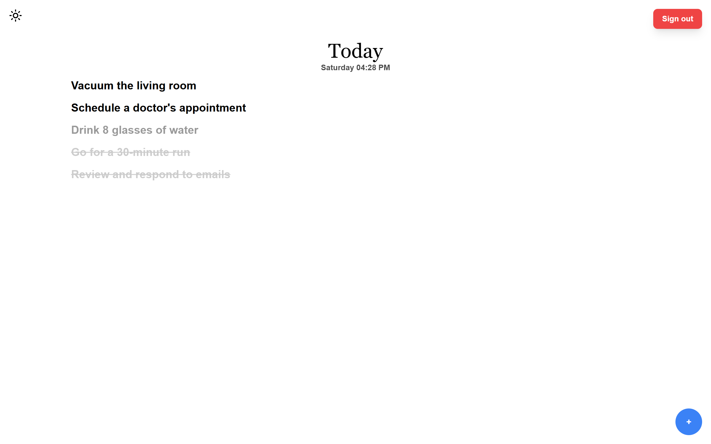
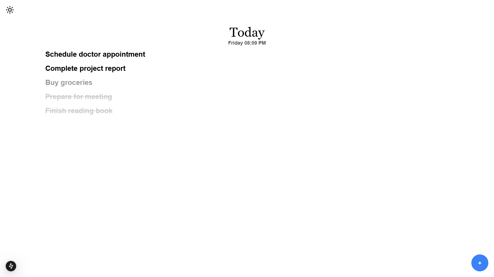
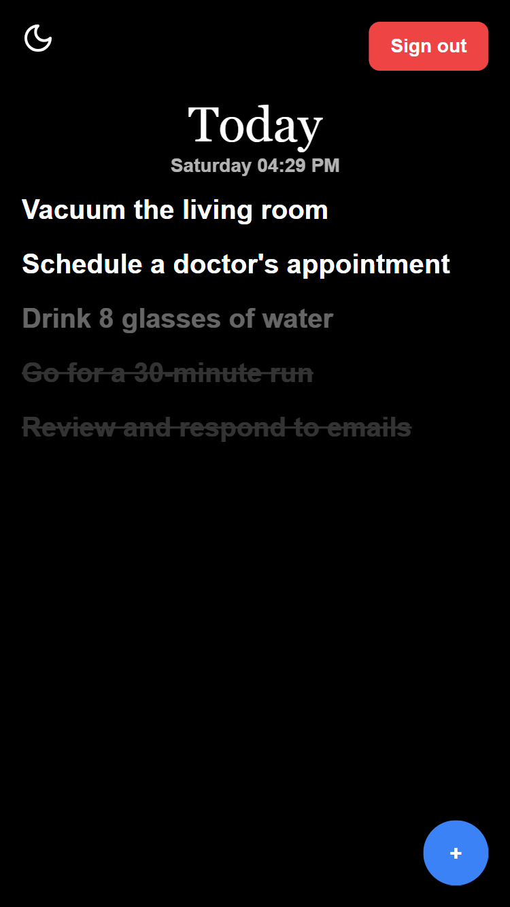
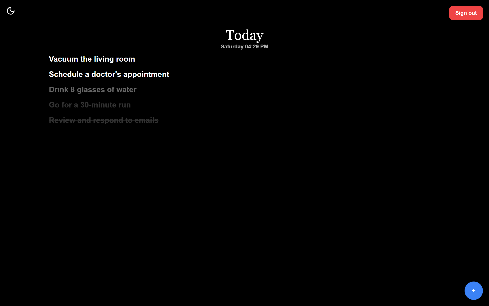

# Today Notes

Today Notes is a lightweight, daily task management application built using **Next.js**, **React**, **TailwindCSS**, **Prisma**, and **Postgresql - Supabase**. It allows users to create tasks that expire in 24 hours, providing a clean and minimalist interface with support for dark and light themes.

## **Psychology Behind "Today" Notes**

The name "Today Notes" reflects the principle of focusing on the tasks that matter most today. Human psychology often leads to procrastination, with the tendency to push tasks into the future. Research suggests that tasks seem less intimidating when we break them down into smaller, more immediate goals.

By limiting tasks to today, the app encourages users to focus on what they can achieve now. The concept of "planning for today before tomorrow" is grounded in behavioral psychology, where creating urgency helps combat procrastination, enhances focus, and boosts productivity. With automatic task expiration, there's no option to "put it off until tomorrow"—the goal is to complete today’s tasks, making each day more productive and fulfilling.

## **Features**
- **Task Management**:
  - Add new tasks quickly with a floating action button (FAB).
  - Mark tasks as done, re-add expired tasks, or delete them.
  - Tasks automatically expire after 24 hours.
  - Tasks automatically delete after 48 hours.
- **Optimistic UI Updates**:
  - Tasks update in the UI before server confirmation to enhance user experience.
- **Theming**:
  - Supports light and dark modes with a customizable theme switcher.
- **Notifications**:
  - Real-time feedback with toast notifications using `react-hot-toast`.
- **Data Persistence**:
  - Uses Postgresql - Supabase for data persistence and Prisma ORM.

## **Technologies Used**
- **Frontend**: Next.js, React, TailwindCSS
- **Backend**: Next.js RESTful API Routes, Prisma, POSTGRESQL - Supabase
- **State Management**: React Hooks (useState, useEffect)
- **Notifications**: `react-hot-toast`
- **Styling**: TailwindCSS

## **Screenshots**

## **Usage**

- **Login via Google:** Click the `Login with Google` button to sign in.
- **Add Task:** Click the floating `+` button and type in your task.
- **Mark Task as Done:** Click on a task to mark it as done.
- **Re-add Expired Task:** Click on an expired task to re-add it to the active list.
- **Automatic Expiry and Deletion:** Tasks expire after 24 hours and are deleted after 48 hours.

## **License**
This project is licensed under the MIT License. See the [LICENSE](LICENSE) file for details.

---

**Enjoy managing your daily tasks with Today Notes!**