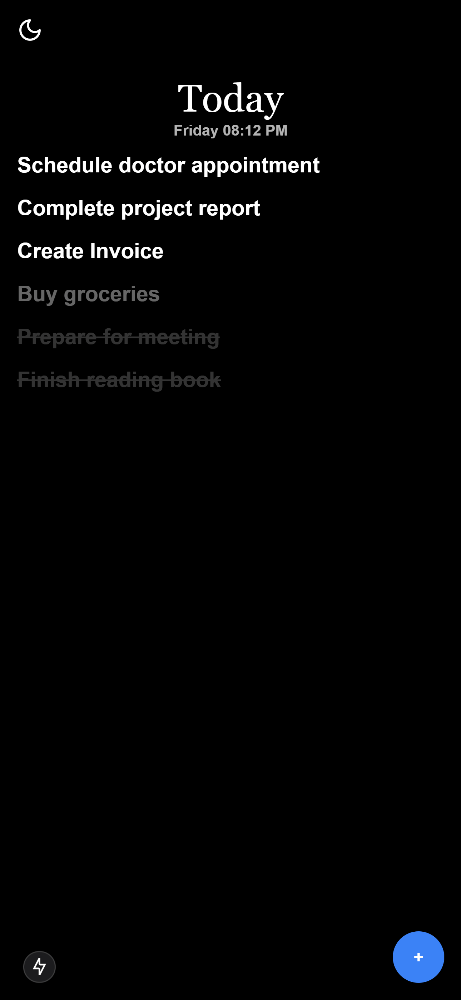

# Today Notes

Today Notes is a lightweight, daily task management application built using **Next.js**, **React**, **TailwindCSS**, **Prisma**, and **Postgresql - Supabase**. It allows users to create tasks that expire in 24 hours, providing a clean and minimalist interface with support for dark and light themes.

## **Features**
- **Task Management**:
  - Add new tasks quickly with a floating action button (FAB).
  - Mark tasks as done, re-add expired tasks, or delete them.
  - Tasks automatically expire after 24 hours.
  - Tasks automatically delete after 48 hours.
- **Optimistic UI Updates**:
  - Tasks update in the UI before server confirmation to enhance user experience.
- **Theming**:
  - Supports light and dark modes with a customizable theme switcher.
- **Notifications**:
  - Real-time feedback with toast notifications using `react-hot-toast`.
- **Data Persistence**:
  - Uses Postgresql - Supabase for data persistence and Prisma ORM.

## **Technologies Used**
- **Frontend**: Next.js, React, TailwindCSS
- **Backend**: Next.js RESTful API Routes, Prisma, POSTGRESQL - Supabase
- **State Management**: React Hooks (useState, useEffect)
- **Notifications**: `react-hot-toast`
- **Styling**: TailwindCSS

## **Screenshots**




## **Usage**

- **Login via Google:** Click the `Login with Google` button to sign in.
- **Add Task:** Click the floating `+` button and type in your task.
- **Mark Task as Done:** Click on a task to mark it as done.
- **Re-add Expired Task:** Click on an expired task to re-add it to the active list.
- **Automatic Expiry and Deletion:** Tasks expire after 24 hours and are deleted after 48 hours.

## **Project Structure**
```
today-notes-app/
├── prisma
│   ├── migrations
│   │   ├── 20241201072809_init_supabase
│   │   ├── 20241201073523_init_supabase
│   │   └── migration_lock.toml
│   └── schema.prisma
├── public
│   ├── file.svg
│   ├── globe.svg
│   ├── next.svg
│   ├── vercel.svg
│   └── window.svg
├── src
│   ├── app
│   │   ├── components
│   │   ├── fonts
│   │   ├── globals.css
│   │   ├── layout.tsx
│   │   ├── page.tsx
│   │   └── providers.tsx
│   ├── lib
│   │   └── prisma.ts
│   ├── pages
│   │   └── api
│   └── services
│       └── taskService.ts
├── tailwind.config.ts
└── tsconfig.json
```
## **License**
This project is licensed under the MIT License. See the [LICENSE](LICENSE) file for details.

---

**Enjoy managing your daily tasks with Today Notes!**